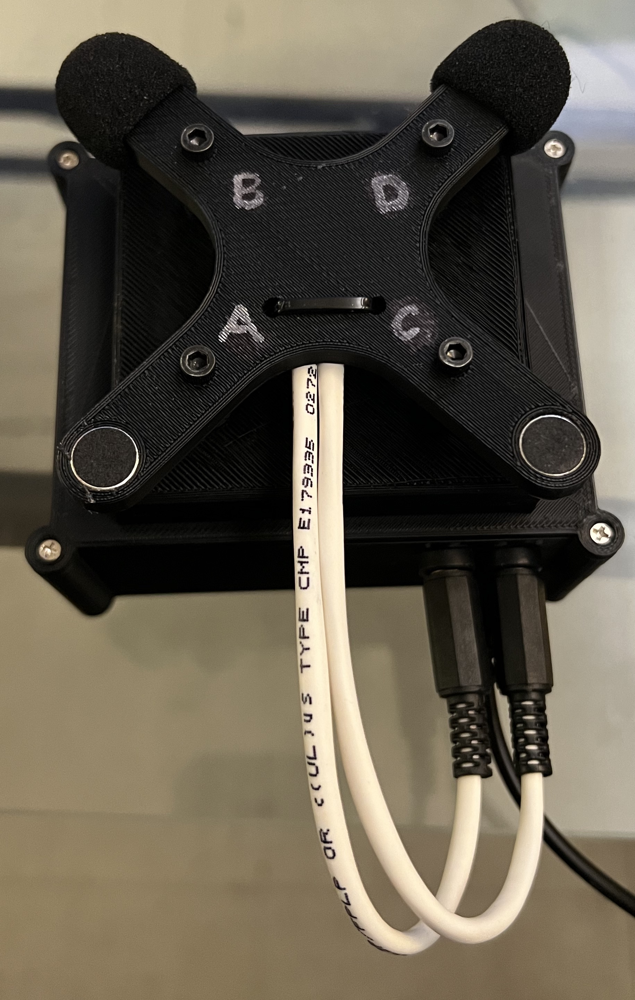
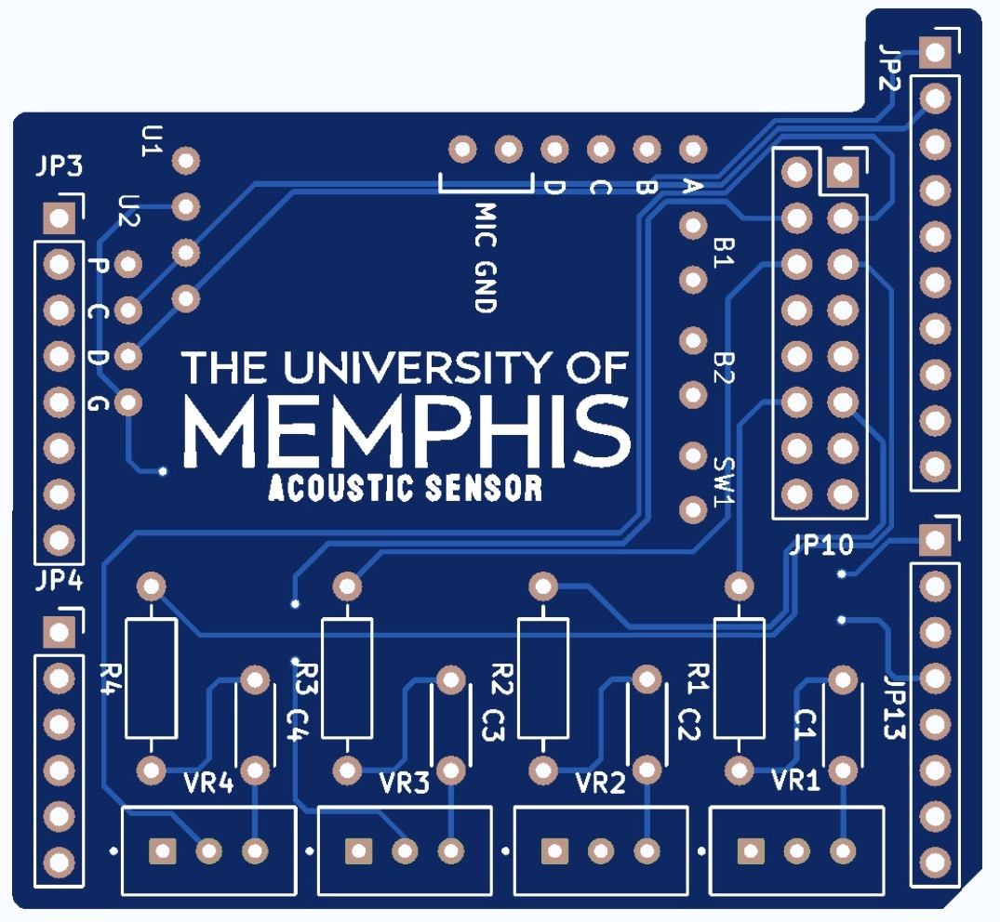
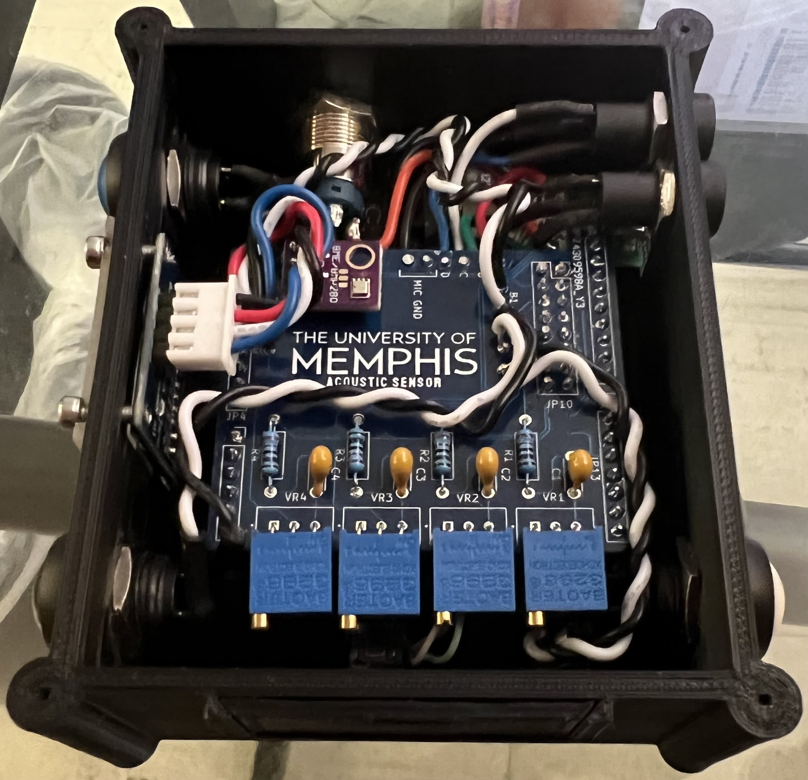
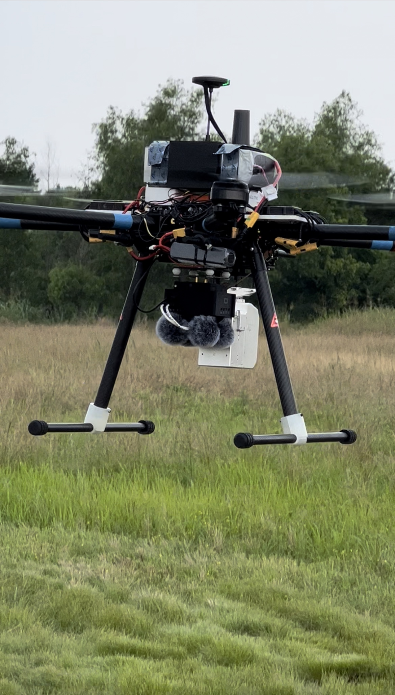
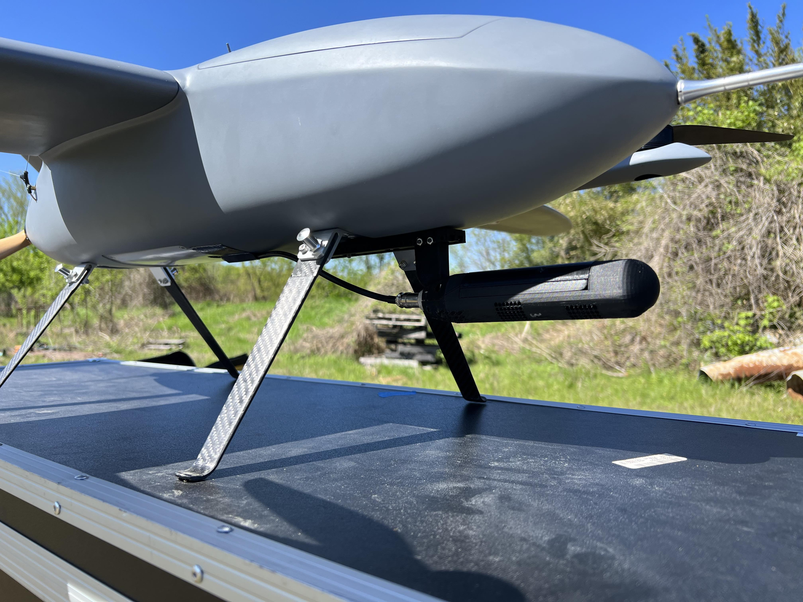
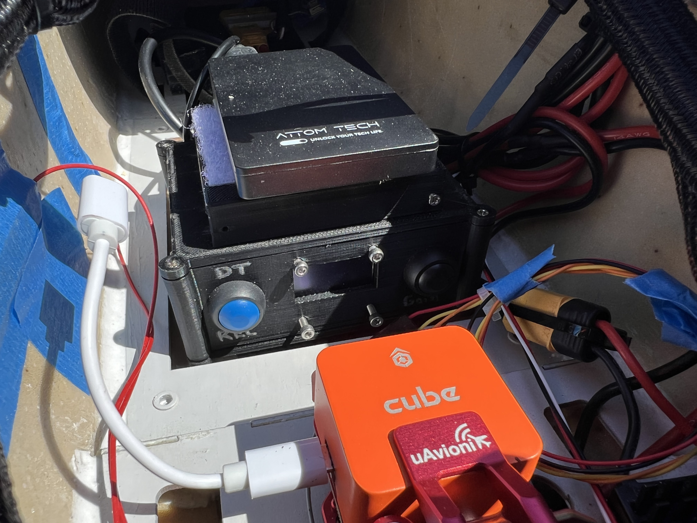

# Acoustic Sensor
	- University of Memphis
	- Multiple Unmanned Ariel System Project
	- Army Research Lab

The audio recording device used in the experiment was the Sony Spresense microcontroller with custom firmware developed to enable recording across four analog channels at a 16-bit resolution and a 48 kHz sampling rate. We utilized the CMI-5247TF-K10 electret condenser microphone, recommended by Spresense documentation for its compatibility and straightforward setup with the microcontroller. This unidirectional microphone has an operational frequency range of 70 Hz to 20 kHz. Additionally, a shield circuit was designed for the microcontroller to integrate microphone inputs, potentiometers for calibrating microphone levels, an OLED display screen, and sensors for temperature, humidity, and pressure. The device’s enclosure and microphone mount were designed using CAD software and produced via 3D printing. For wind noise mitigation, the microphones were equipped with dual layers of wind protection: an initial layer consisting of thin foam covers typical for lavalier microphones, followed by wind muffs also designed for lavalier microphones. While this setup effectively reduces wind noise for winds up to 5 m/s, there remains considerable scope for enhancing physical wind noise reduction techniques.

## Read Manual.md for specific instructions on data collection

## Acoustic_Firmware
	- firmware and header files for arduino IDE upload
	- Acoustic_Firmware.ino
	- screen.h
	- temp.h

## BIN
	- this needs to be on the sony spresense formated SD card
	- includes the audio codecs used for recording
	- gain.txt file to store the default gain setting

## Docs
	- Recorder Schematic
	- Parts List
	- Recorder Versions
	- Sony Microcontroller Notes

## Enclosure
	- 3D Printer Enclosure files
	- MicModuleBoxrev3.data
	- MicModuleBoxrev3.gcode

## Shield
	- Sony Spresense Shield KiCad File
	- Mic Resisters: 2.2k Ohms
	- Capacitors: 1uF
	- Potentiometers: 500k Ohms

# Acoustic Sensor

# KiCad Model

# In Action

